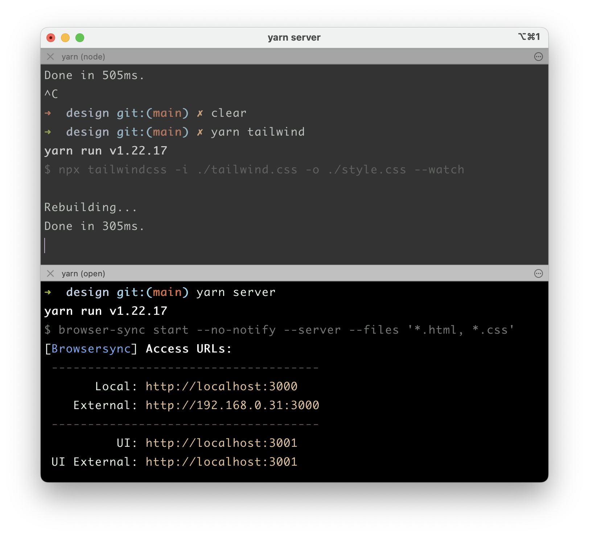

## Tailwind Sandbox

Si estás cansado de cambiar una clase de Tailwind, presionar `alt + tab` y recargar toda la aplicación para ver el cambio que hiciste, pruébalo.  

Usa esto como tu entorno de pruebas local para construir rápidamente pequeños componentes de Tailwind. El navegador se recarga automáticamente después de realizar un cambio y guardar. Una vez que estés satisfecho con un diseño, cópialo y pégalo en tu proyecto principal.

**¿Qué hay de Tailwind Playground?**

[Tailwind playground](https://play.tailwindcss.com/) es genial, pero me gusta trabajar en mi IDE favorito con mis fuentes y temas favoritos. Espero que a ti también. 

## Instalación

```bash
git clone https://github.com/akshayKhot/design.git your_project_name
cd your_project_name
yarn upgrade-interactive --latest
yarn # or npm install (optional)
```

## Uso

Ejecuta estos comandos en pestañas separadas de la terminal. 

**yarn**

```bash
yarn tailwind
yarn server
```

**npm**

```bash
npm run tailwind
npm run server
```

Prefiero y recomiendo usar yarn, es muy rápido en comparación con npm. 



Y con eso basta. Ahora ve y crea algunos diseños geniales.
