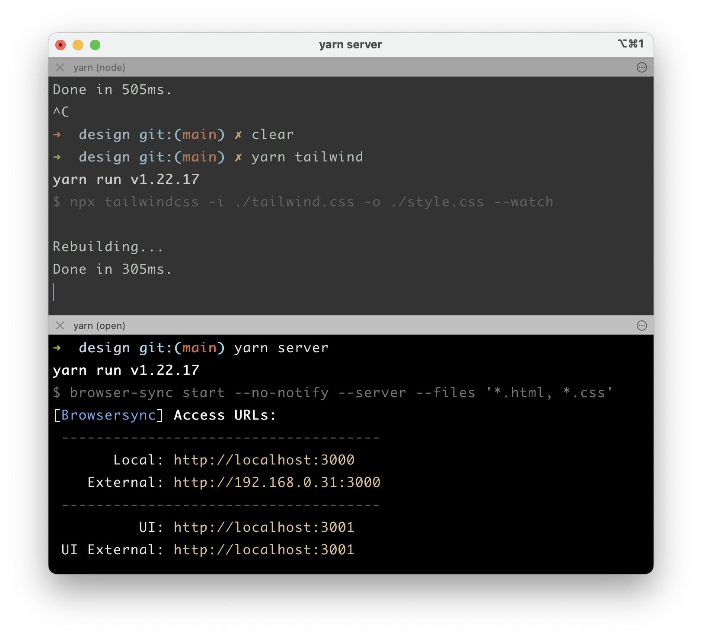

## Tailwind Sandbox

If you are tired of changing a Tailwind class, doing `alt + tab`, and reloading the whole app to see the change your made, give it a try.  

Treat this as your local sandbox to quickly build small Tailwind components. The browser reloads automatically after you make a change and save. Once you're satisfied with a design, copy + paste it in your main project.

**What about Tailwind Playground?**

[Tailwind playground](https://play.tailwindcss.com/) is great, but I do like to work in my favorite IDE with my favorite fonts and themes. Hope you do, too. 

## Install

```bash
git clone https://github.com/akshayKhot/design.git your_project_name
cd your_project_name
yarn # or npm install
```

## Usage

Run these commands in separate terminal tabs. 

**yarn**

```bash
yarn tailwind
yarn server
```

**npm**

```bash
npm run tailwind
npm run server
```

I prefer and recommend using yarn, it's very fast compared to npm. 



That's it. Now go build some great designs. 
